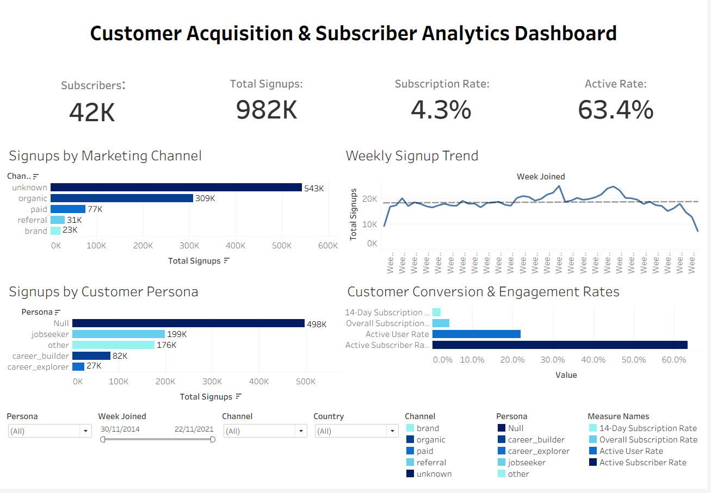

# Customer Acquisition & Subscriber Analytics Dashboard

An interactive Tableau dashboard designed to analyse customer acquisition, subscriber growth, marketing channel performance, customer personas, and engagement metrics. This project demonstrates how Tableau can transform raw marketing data into actionable business insights through effective visualisation, calculated fields, dashboard interactivity, and executive-level reporting.

---

## Dashboard Preview



---

## Project Overview

Businesses invest heavily in multiple marketing channels to acquire new customers. Understanding which channels generate the most signups, how customer acquisition changes over time, which customer personas dominate the platform, and how effectively users convert into active subscribers is essential for marketing optimisation.

This dashboard provides an executive-level overview of customer acquisition and subscriber performance while allowing users to interactively filter results by:

- Customer Persona
- Marketing Channel
- Country
- Week Joined

---

## Business Objectives

The dashboard was developed to answer several key business questions:

- Which marketing channels generate the highest number of customer signups?
- How have customer signups changed over time?
- Which customer personas contribute the largest share of signups?
- What percentage of customers become subscribers?
- How effectively are subscribers engaging with the platform?
- How do acquisition and engagement metrics vary by country, channel, persona, and time period?

---

# Dataset

The dataset contains customer acquisition and engagement information including:

- Week Joined
- Country
- Marketing Channel
- Customer Persona
- Total Signups
- Total Minutes Spent
- Subscribers within First 14 Days
- Total Subscribers
- Active Users (>1 Hour)
- Active Subscribers

---

# Tools Used

- Tableau Public
- Tableau Calculated Fields
- Interactive Dashboard Actions
- Dashboard Containers
- Filters
- Custom Formatting

---

# Dashboard Features

## Executive KPI Cards

The dashboard provides four high-level KPIs:

- Total Signups
- Total Subscribers
- Subscription Rate
- Active Subscriber Rate

These KPIs provide an immediate overview of acquisition, conversion and customer engagement performance.

---

## Signups by Marketing Channel

A horizontal bar chart compares customer acquisition across marketing channels.

Insights include:

- Highest performing marketing channels
- Lowest performing channels
- Relative contribution of each acquisition source

---

## Weekly Signup Trend

A time-series line chart visualises customer acquisition over time.

This enables users to identify:

- Growth trends
- Seasonal patterns
- Weekly fluctuations
- Periods of declining acquisition

---

## Signups by Customer Persona

A horizontal bar chart segments customer acquisition by customer persona.

This visual helps identify:

- Largest customer segments
- Underrepresented customer groups
- Marketing opportunities

---

## Customer Conversion & Engagement Rates

A calculated-field comparison showing key business performance metrics:

- 14-Day Subscription Rate
- Overall Subscription Rate
- Active User Rate
- Active Subscriber Rate

These metrics provide a snapshot of customer conversion and platform engagement.

---

# Calculated Fields

The following calculated fields were created within Tableau.

## 14-Day Subscription Rate

```tableau
SUM([Total Subscribed in First 14 Days Window])
/
SUM([Total Signups])
```

---

## Overall Subscription Rate

```tableau
SUM([Total Subscribers])
/
SUM([Total Signups])
```

---

## Active User Rate

```tableau
SUM([Active > 1 Hour])
/
SUM([Total Signups])
```

---

## Active Subscriber Rate

```tableau
SUM([Active Subscribers])
/
SUM([Total Subscribers])
```

---

# Dashboard Interactivity

Users can dynamically filter every visual using:

- Customer Persona
- Marketing Channel
- Country
- Week Joined

All filters are synchronised across the dashboard, allowing users to explore customer acquisition from multiple perspectives.

---

# Key Findings

## Marketing Performance

- Unknown and Organic channels generated the highest number of customer signups.
- Paid, Referral and Brand channels contributed a significantly smaller share of total acquisition.

## Customer Acquisition

- Customer acquisition remained relatively stable throughout most of the reporting period before declining towards the end of the dataset.

## Customer Personas

- The largest proportion of signups originated from users without an assigned persona.
- Jobseekers represented the largest identified customer segment.

## Subscriber Performance

- Overall Subscription Rate remained relatively low compared to total signups.
- Active Subscriber Rate exceeded 60%, indicating that subscribers who converted generally remained engaged with the platform.

---

# Business Recommendations

Based on the analysis, several actions could improve customer acquisition and engagement:

### Improve Marketing Attribution

A large proportion of signups are categorised as **Unknown**, limiting the ability to evaluate channel performance accurately.

### Increase Subscription Conversion

Focus on improving onboarding journeys and targeted marketing campaigns to increase the percentage of users who convert into subscribers.

### Improve Persona Classification

Reducing uncategorised customer personas would enable more effective customer segmentation and personalised marketing.

### Monitor Acquisition Trends

Track weekly acquisition performance to quickly identify declining signup activity and evaluate campaign effectiveness.

### Improve Customer Engagement

Analyse behaviours associated with highly active subscribers to encourage greater engagement among new users.

---

# Skills Demonstrated

- Tableau Dashboard Development
- Dashboard Containers
- Interactive Filters
- Calculated Fields
- KPI Design
- Time-Series Analysis
- Customer Segmentation
- Marketing Analytics
- Data Storytelling
- Business Intelligence Reporting

---

# Learning Outcomes

This project strengthened practical experience in:

- Designing professional Tableau dashboards
- Creating reusable calculated fields
- Building executive KPI cards
- Developing interactive dashboards
- Applying dashboard design best practices
- Translating marketing data into actionable business insights

---

# Future Improvements

Potential enhancements include:

- Geographic map visualisations by country
- Marketing channel drill-through analysis
- Cohort retention analysis
- Campaign ROI calculations
- Parameter-driven KPI selection
- Advanced dashboard actions
- Predictive forecasting of customer acquisition

---

## Author

**Steven Tapscott**

Aspiring Data Analyst specialising in SQL, Python, Excel, Power BI and Tableau.

GitHub Portfolio showcasing end-to-end data analytics and business intelligence projects.
